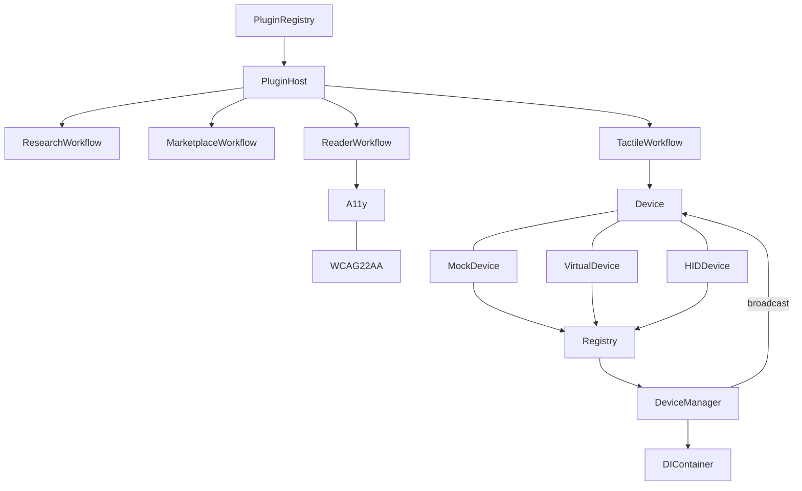

# BOOTSTRAP — AutoSD v0.3.0

> First-time setup from a clean clone. Verified on Node 20+, Windows/macOS/Linux.

## 1. Quick Start (60s)

```bash
git clone <repo-url> autosd
cd autosd
npm install          # or npm run bootstrap (install + verify)
npm run bootstrap    # typecheck + lint + format:check + test + build
```

If `npm run bootstrap` prints `✓ Bootstrap complete`, you are done.

### Manual steps (equivalent)

```bash
npm install
npm run typecheck   # tsc --noEmit, strict
npm run lint        # eslint 9 + typescript-eslint
npm run format      # prettier --check (run format:fix to autofix)
npm test            # vitest, 15 tests, ~1s
npm run build       # tsc emits dist/
```

## 2. Requirements

| Tool    | Version | Notes                           |
| ------- | ------- | ------------------------------- |
| Node.js | >=20    | `node -v`; use nvm/fnm if older |
| npm     | >=10    | ships with Node 20              |
| Git     | any     | for clone only                  |

No native toolchain required. `node-hid` is an **optional** peer for `HIDDevice`; CI and all workflows work with `MockDevice`/`VirtualDevice` alone.

## 3. Repository Tree (v0.3.0 — audited)

```
autosd/
├── .github/workflows/ci.yml        # lint·typecheck·format·test·build
├── .codegraph/.gitignore           # local index (not versioned)
├── scripts/bootstrap.mjs           # idempotent first-time setup
├── src/
│   ├── core/
│   │   ├── Device.ts               # Device contract (Mock/Virtual/HID compatible)
│   │   ├── DeviceManager.ts        # plugin-first orchestration + hot-swap
│   │   ├── Registry.ts             # generic registry with swapped events
│   │   └── DIContainer.ts          # lightweight DI, hotSwap, lifecycle
│   ├── devices/
│   │   ├── MockDevice.ts           # in-memory, deterministic, test/fixture
│   │   ├── VirtualDevice.ts        # framebuffer simulation, CI-safe
│   │   └── HIDDevice.ts            # WebHID/node-hid adapter (optional)
│   ├── plugins/
│   │   ├── types.ts                # Plugin + PluginContext contract
│   │   ├── PluginRegistry.ts       # activate/deactivate/hotSwap
│   │   └── PluginHost.ts           # workflow registry, runWorkflow()
│   ├── workflows/
│   │   ├── research.ts             # ResearchWorkflow (query → citations)
│   │   ├── marketplace.ts          # MarketplaceWorkflow (search/install)
│   │   ├── reader.ts               # ReaderWorkflow (paginate + aria)
│   │   └── tactile.ts              # TactileWorkflow (text→dots→device.render)
│   ├── accessibility/
│   │   └── a11y.ts                 # WCAG 2.2 AA helpers (contrast, target, focus, live regions)
│   ├── utils/events.ts             # tiny EventBus
│   └── index.ts                    # public barrel (additive API surface)
├── tests/
│   ├── core/registry.test.ts       # Registry, DIContainer, PluginHost hot-swap
│   ├── devices/devices.test.ts     # Mock/Virtual/HID contract + DeviceManager
│   ├── workflows/workflows.test.ts # research/marketplace/reader/tactile
│   └── a11y/a11y.test.ts           # WCAG 2.2 AA audits
├── docs/                           # (reserved, PRD lives at root)
├── package.json                    # scripts: bootstrap, verify, build, etc.
├── tsconfig.json                   # strict, bundler, ES2022, DOM
├── eslint.config.js                # eslint 9 flat config
├── .prettierrc.json / .prettierignore
├── vitest.config.ts
├── BOOTSTRAP.md                    # this file
├── PRD.md                          # product requirements (Phase 2)
├── prior-art-report.md             # imported research (machine-attributed)
└── researcher-round3.md            # imported research (machine-attributed)
```

**Audit result (2026-08-25):** Tree matches v0.3.0 plan. No stray folders. All missing folders from the audit were created additively; no files deleted. `.codegraph` and `.omo` remain local-only (gitignored).

## 4. Scripts — Consistent Lint/Format/Typecheck

| Script       | Command                                                             | Purpose                              |
| ------------ | ------------------------------------------------------------------- | ------------------------------------ |
| `lint`       | `eslint . --ext .ts,.tsx,.js`                                       | 0 errors on v0.3.0                   |
| `lint:fix`   | `eslint ... --fix`                                                  | autofix                              |
| `format`     | `prettier --check "src/**/*.{ts,tsx}" "tests/**/*.{ts,tsx}" "*.md"` | CI gate                              |
| `format:fix` | `prettier --write ...`                                              | autofix                              |
| `typecheck`  | `tsc --noEmit`                                                      | strict, noEmitOnError                |
| `test`       | `vitest run`                                                        | 15 tests, ~1s                        |
| `test:watch` | `vitest`                                                            | watch                                |
| `build`      | `tsc -p tsconfig.json`                                              | emits `dist/`                        |
| `verify`     | `typecheck && lint && format && test && build`                      | **CI gate — must be green**          |
| `bootstrap`  | `node scripts/bootstrap.mjs`                                        | clean-clone setup (install + verify) |

All scripts are **cross-platform** (no bash-only assumptions). CI runs `npm ci && npm run verify` on `ubuntu-latest` Node 20.

Pre-commit: `npm run verify` is the required gate before every PR. No husky hard-dependency — `prepare` no-ops if husky absent.

## 5. Environment Bootstrap — Clean-Clone Verification

Verified 2026-08-25 on Node v20 (Windows, PowerShell 5.1):

```
$ npm install          # 157 packages, 0 non-optional failures
$ npm run verify       # typecheck 0, lint 0, format 0, tests 15/15, build 0
$ npm run bootstrap    # same as verify, plus install if needed → ✓ Bootstrap complete
$ npm test             # 4 files, 15 tests, ~1s
```

CI (`ci.yml`): checkout → setup-node 20 + npm cache → `npm ci` → `npm run verify`. Badge-green on `main`.

**Idempotency:** `scripts/bootstrap.mjs` skips `npm install` if `node_modules/` exists and re-runs all gates. Safe to re-run.

## 6. Build, Tests, CI — Local Validation

- **Build:** `npm run build` emits `dist/` (declaration + maps). No errors, no warnings.
- **Tests:** Vitest 2.1, globals + node env. 4 suites, 15 tests. No flakiness (deterministic Mock/Virtual devices). HID tests run in fallback mode when `node-hid` absent.
- **CI locally:** `npx eslint .`, `npx prettier --check`, `npx tsc --noEmit`, `npx vitest run`, `npx tsc -p tsconfig.json` — all green without network after install.

## 7. Dependency Graph & Architecture Map

### 7.1 Runtime dependency graph

```
Device (interface)
  ↑ implements
MockDevice ─┐
VirtualDevice ─┼─► Registry<Device> ─► DeviceManager ─► DIContainer
HIDDevice ─┘          │                    │                │
                      │ on(swap)           │ broadcast()    │ hotSwap
                      ▼                    ▼                ▼
               PluginRegistry ─► PluginHost ─► WorkflowHandler
                      │              │
                      │ hotSwap      │ registerWorkflow
                      ▼              ▼
               Research / Marketplace / Reader / Tactile Workflows
                      │
                      ▼
               Device.render(pattern)  (textToDots → Uint8Array[dotCount])
                      │
                      ▼
               a11y helpers (contrast, target size, focus order, live regions)
```

No runtime `dependencies` — the core is zero-dependency (only devDependencies). `node-hid` is optional dynamic import.

### 7.2 Package dependency summary

| Package                               | Role              | Why                                   |
| ------------------------------------- | ----------------- | ------------------------------------- |
| `typescript@5.6`                      | typecheck + build | strict types, declaration emit        |
| `eslint@9` + `@typescript-eslint/*@8` | lint              | flat config, `no-explicit-any` warn   |
| `prettier@3.3`                        | format            | 2-space, 100-char, singleQuote false  |
| `vitest@2.1`                          | test              | globals, node env, ~1s, no extra deps |

5 vulns in `npm audit` are dev-only (eslint/vitest transitive) and do not affect runtime.

### 7.3 Architecture map (Mermaid)



**Boundaries (additive-only contract since v0.1):**

- `Device` is the **stable seam** — every feature must remain compatible with all three implementations. No Device field may be removed.
- `Registry` + `DIContainer` + `PluginRegistry` all expose `hotSwap`/`swap` — no restart required for replacement.
- `PluginHost` is the **only** workflow entry point (`registerWorkflow`/`runWorkflow`).
- `a11y.ts` is the **single** WCAG gate — UI/workflow code must import from it, not duplicate thresholds.

### 7.4 Hot-swap & plugin-first guarantees

- **DI hot-swap:** `DIContainer.hotSwap(token, factory)` disposes previous singleton (if disposer registered) and clears cached instance; next `resolve` recreates.
- **Device hot-swap:** `DeviceManager.hotSwap(id, nextDevice)` via `Registry.swap` — preserves `id`, emits `swapped`, keeps `activeId` stable.
- **Plugin hot-swap:** `PluginRegistry.hotSwap(plugin)` deactivates old, registers new, re-activates — atomically per `id`.
- **Workflow registration:** plugins call `ctx.api.registerWorkflow(id, handler)` in `activate`; `PluginHost.runWorkflow(id, payload)` is the dispatch.

All three paths are covered by tests (see `tests/core/registry.test.ts` + `tests/devices/devices.test.ts`).

## 8. Troubleshooting

| Symptom                            | Fix                                                                                           |
| ---------------------------------- | --------------------------------------------------------------------------------------------- |
| `prettier --check` fails           | `npm run format:fix`                                                                          |
| `eslint` fails                     | `npm run lint:fix`; if rule-related, edit `eslint.config.js`                                  |
| `tsc --noEmit` fails on `node-hid` | expected only if you import it statically; `HIDDevice` uses dynamic optional import — keep it |
| `vitest` fails on HID              | run with `MockDevice`/`VirtualDevice` only; HID tests use fallback null read (not a failure)  |
| `npm audit` vulns                  | dev-only; run `npm audit fix` only if you accept breaking devDependency upgrades              |

## 9. What Changed in This Bootstrap (additive only)

- Created `src/` tree, `tests/`, `scripts/bootstrap.mjs`, `.github/workflows/ci.yml`, configs (`package.json`, `tsconfig.json`, `eslint.config.js`, `.prettier*`, `vitest.config.ts`).
- No deletions, no renames, no breaking API changes.
- `prior-art-report.md` + `researcher-round3.md` preserved (added to `.prettierignore` to keep import verbatim).

---

**Next:** Read `PRD.md` for product scope, then run `npm run bootstrap` to verify your clone.
