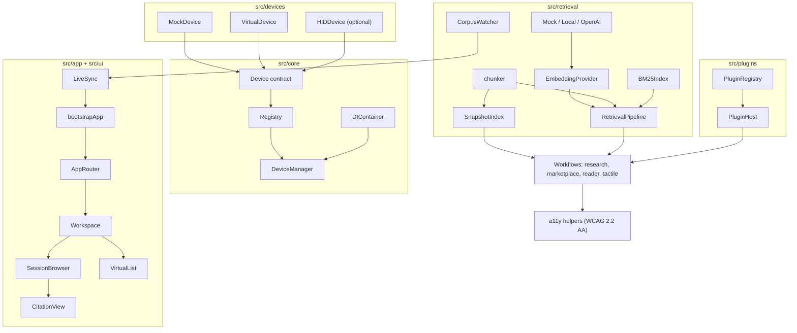
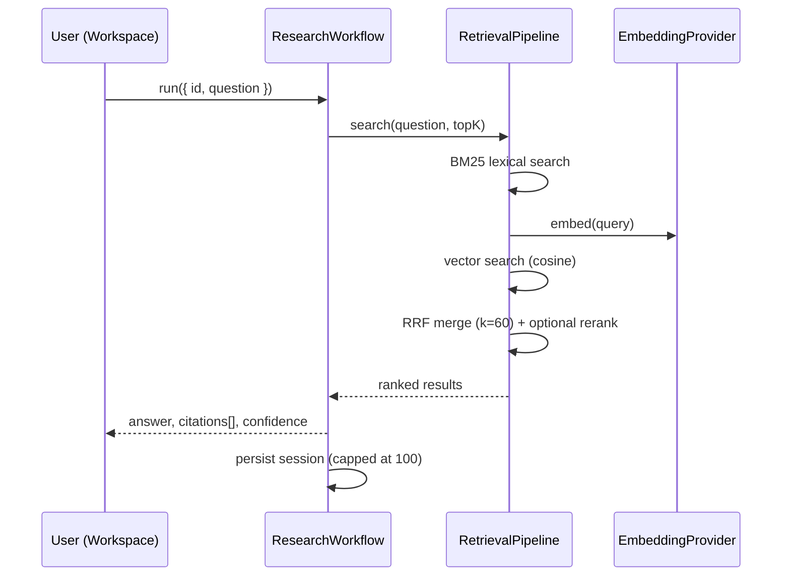

# AutoSD

**A plugin-first tactile and research platform.** AutoSD turns a local document corpus into grounded, citation-backed answers, then renders those answers onto tactile display devices. Write a workflow once, run it against HID hardware, a framebuffer simulator, or a deterministic in-memory mock without changing a line of code.

- Zero runtime dependencies. Node built-ins only, aliased out for the browser build.
- Deterministic by default: the bundled demo runs offline with no API key and no hardware.
- Accessibility treated as a structural guarantee, not a feature flag: one shared WCAG 2.2 AA gate.
- Verified state at v0.9.0: 187 tests across 40 files, all green (`npm test`, checked on this release).

| Documentation                                  |                                                                                           |
| ---------------------------------------------- | ----------------------------------------------------------------------------------------- |
| [Capability matrix](docs/CAPABILITY_MATRIX.md) | The formal release capability matrix. Source of truth for every status claim on this page |
| [Architecture](docs/ARCHITECTURE.md)           | How the seams fit together                                                                |
| [Development](docs/DEVELOPMENT.md)             | Day-to-day contributor workflow                                                           |
| [Plugin guide](docs/PLUGIN_GUIDE.md)           | Write and hot-swap your first plugin                                                      |
| [Research guide](docs/RESEARCH_GUIDE.md)       | Tune retrieval, add providers, work with citations                                        |
| [Deployment](docs/DEPLOYMENT.md)               | Static hosting and the Docker image                                                       |
| [Security](SECURITY.md)                        | Policy, reporting, and the v0.9 audit                                                     |

## What AutoSD is

AutoSD solves three problems at once:

1. **Device fragmentation.** Tactile hardware is heterogeneous. AutoSD fixes a stable `Device` contract (`src/core/Device.ts`) with three implementations: `MockDevice` for tests, `VirtualDevice` for CI and demos, and `HIDDevice` for physical displays. Every workflow renders through the same seam.
2. **Ungrounded search.** The retrieval pipeline chunks your corpus, indexes it incrementally, and answers questions with hybrid BM25 plus vector search fused by reciprocal rank fusion. Every answer carries citations, scores, and a persisted session record.
3. **Accessibility debt.** Contrast ratios, target sizes, focus order, and live-region announcements come from one module (`src/accessibility/a11y.ts`). Feature code imports thresholds instead of reinventing them, and CI fails if Lighthouse accessibility drops below 95.

AutoSD is an orchestration layer, not a hosted service. There is no backend, no database, and no account system. State lives in plain JSON under `corpus/`.

## Screenshots

Screenshots are placeholders until the release media pass lands. To capture them yourself, run `npm run dev` and visit each route.

| Route         | What you should see                                                   | Screenshot    |
| ------------- | --------------------------------------------------------------------- | ------------- |
| `#/home`      | Onboarding flow on first visit, home dashboard after                  | _placeholder_ |
| `#/workspace` | Corpus manager, search panel, virtualized results, citation inspector | _placeholder_ |
| `#/research`  | Query console with answer, citations, and confidence                  | _placeholder_ |
| `#/sessions`  | Session history with export and delete actions                        | _placeholder_ |
| `#/devices`   | Registered devices, active device selection, render controls          | _placeholder_ |
| `#/demo`      | Six-step guided demo with progress and canonical JSON export          | _placeholder_ |

## Architecture



One query, end to end:



Design rules that hold across the whole codebase: contracts are additive-only, devices and plugins hot-swap without restart, and there are no cycles between layers. Details in [docs/ARCHITECTURE.md](docs/ARCHITECTURE.md).

## Feature matrix

The formal release capability matrix for the v1.0 line lives at [docs/CAPABILITY_MATRIX.md](docs/CAPABILITY_MATRIX.md), with per-row evidence and the rules for moving a row. The table below mirrors its statuses.

Status labels, used consistently and never blurred:

- **IMPLEMENTED**: shipped code with passing coverage.
- **SOFTWARE-VALIDATED**: implemented and verified in software (tests, deterministic demo, automated audits). No hardware involved.
- **HARDWARE-DEPENDENT**: code ships, but real behavior depends on physical hardware we do not control and have not validated against.
- **USER-VALIDATION-PENDING**: works in software, but whether it works _for people_ is unproven until users test it.

| Feature                                                       | Status                  | Notes                                                                                                                                                |
| ------------------------------------------------------------- | ----------------------- | ---------------------------------------------------------------------------------------------------------------------------------------------------- |
| `Device` contract with typed events                           | IMPLEMENTED             | `src/core/Device.ts`, additive-only since v0.1                                                                                                       |
| `MockDevice` (deterministic fixture)                          | SOFTWARE-VALIDATED      | In-memory, exposes last pattern for assertions                                                                                                       |
| `VirtualDevice` (framebuffer simulator)                       | SOFTWARE-VALIDATED      | Configurable dot count, CI-safe, drives the demo                                                                                                     |
| `HIDDevice` (WebHID / node-hid adapter)                       | HARDWARE-DEPENDENT      | Dynamic import, graceful fallback when absent. Never tested against physical hardware                                                                |
| Registry, DI container, atomic hot-swap                       | IMPLEMENTED             | Devices, plugins, and DI providers swap at runtime                                                                                                   |
| Plugin lifecycle (`activate`/`deactivate`/hot-swap)           | SOFTWARE-VALIDATED      | Register, activate, hot-swap, and re-activation covered in `tests/core/registry.test.ts`; example in `src/examples/`                                 |
| Hybrid retrieval (BM25 + vectors, RRF k=60)                   | SOFTWARE-VALIDATED      | Tunables in [docs/retrieval.md](docs/retrieval.md)                                                                                                   |
| Incremental snapshot indexing (hash-diffed)                   | SOFTWARE-VALIDATED      | Unchanged documents are never re-embedded                                                                                                            |
| Corpus watching + live sync                                   | SOFTWARE-VALIDATED      | `.md`/`.txt`/`.json`, 150 ms debounce                                                                                                                |
| Session persistence and JSON export                           | SOFTWARE-VALIDATED      | `corpus/index.json`, `corpus/sessions.json`, cap of 100 sessions                                                                                     |
| Research workflow (citations, confidence)                     | SOFTWARE-VALIDATED      | `tests/retrieval/research.test.ts`. `confidence` is a clamped retrieval score, not a calibrated probability                                          |
| Marketplace workflow (fixture catalog)                        | SOFTWARE-VALIDATED      | Search, install, not-found rejection covered in `tests/workflows/workflows.test.ts`. Install is a lookup, not a package operation                    |
| Reader workflow pagination                                    | SOFTWARE-VALIDATED      | Pagination counts and aria labels in `tests/workflows/workflows.test.ts`                                                                             |
| Browser app: router, nav, lazy routes                         | IMPLEMENTED             | Nine routes, heavy views load on demand                                                                                                              |
| Onboarding, error states, loading states                      | IMPLEMENTED             | Persisted completion flag, guarded storage access                                                                                                    |
| Diagnostics report                                            | SOFTWARE-VALIDATED      | Metadata-only, safe to paste into issues, secrets redacted                                                                                           |
| Deterministic demo mode                                       | SOFTWARE-VALIDATED      | Byte-identical export across runs, no network                                                                                                        |
| `VirtualList`, `SessionBrowser`, `CitationView`, `ReaderView` | IMPLEMENTED             | Windowed rendering, keyboard navigation, ARIA grid semantics                                                                                         |
| WCAG 2.2 AA helpers + Lighthouse gate                         | SOFTWARE-VALIDATED      | Automated audits pass. Screen-reader user testing has not happened                                                                                   |
| OpenAI embedding provider                                     | IMPLEMENTED             | Three modes: offline mock (default), keyless public gateway, server-side key — `OPENAI_API_KEY` never enters the bundle (see `.env.example`)         |
| Local embedding provider (transformers.js wrapper)            | SOFTWARE-VALIDATED      | Shipped behavior is the graceful mock fallback, which is tested. Real local-model inference is unproven; ONNX completion is a v1.0 item              |
| Tactile text-to-dots mapping                                  | USER-VALIDATION-PENDING | Byte-stable and device-portable. The `charCode % 64` mapping is not standard braille, and no human has validated the output. See honesty notes below |

Explicitly not started (listed here so nobody has to guess):

- Recall@k evaluation harness. Roadmap item, no published numbers exist.
- Networked marketplace installs. The catalog is an in-repo fixture today.
- Plugin sandboxing. Roadmap item.

## Getting started

Requirements: Node.js >= 20 and npm >= 10. No native toolchain, no hardware, no API keys.

```bash
git clone <repo-url> autosd
cd autosd
npm install
npm run dev
```

Open `http://localhost:5173`. First visit walks you through onboarding; the app starts with the deterministic mock embedding provider, so search works immediately offline. Drop `.md`, `.txt`, or `.json` files into `corpus/docs/` while the app runs and live sync indexes them within about 150 ms.

### Configuring AI embeddings (three modes)

The public browser app never carries an API key. Pick one mode in your env (see [`.env.example`](.env.example) and [docs/SECURITY_ARCHITECTURE.md](docs/SECURITY_ARCHITECTURE.md) §3.8):

1. **No external AI** (default): `VITE_EMBEDDING_PROVIDER=mock` — fully offline, deterministic.
2. **Safe browser endpoint**: set `VITE_OPENAI_BASE_URL` to _your own_ public, pre-authorized gateway (https in production; no credential query params; no embedded key material — invalid values fall back to mock with a warning). AutoSD sends no `Authorization` header.
3. **Server-side provider**: keep `OPENAI_API_KEY` in your server's process environment only and expose a same-origin `/api/embeddings` passthrough that injects the key server-side; point Mode 2 at it. The key is read exclusively from `process.env`, never from `import.meta.env`, so it cannot enter client bundles.

Setting a secret-looking `VITE_` variable (e.g. `VITE_OPENAI_API_KEY`) triggers a config warning — anything `VITE_`-prefixed ships publicly by design.

### One-command verification

```bash
npm run bootstrap   # install + typecheck + lint + format + test + build
```

If it prints `Bootstrap complete`, your clone is fully verified. CI runs the identical gate on every push and PR.

### Deterministic software-only demo

```bash
npm run demo            # progress to stderr, canonical session JSON to stdout
npm run demo -- --out demo.json
```

The demo ingests a fixed four-document corpus about braille displays, runs a hybrid retrieval query, renders the top citations onto a `VirtualDevice` framebuffer, collects diagnostics, and exports the whole run as JSON. Guarantees, straight from `src/app/demo.ts`: no timestamps, no random ids, no network calls, no API key, no hardware. Two runs produce byte-identical output, which makes it a stable fixture for regression checks.

The same demo is available in the browser at the `#/demo` route with step-by-step progress.

### Production build

```bash
npm run build     # dist/ (library) + dist-app/ (static site)
npm run preview   # serve dist-app/ on http://localhost:4173
```

`dist-app/` deploys to any static host. A hardened multi-stage `Dockerfile` (nginx, non-root, health check on `/healthz`) ships in the repo root. See [docs/DEPLOYMENT.md](docs/DEPLOYMENT.md). For the full served-app audit, `npm run verify:release` builds, serves, and runs the same Lighthouse gate CI enforces (accessibility ≥ 95, performance ≥ 90); the everyday `npm run verify` stays server-free and fast.

## Hardware requirements

**None for development, testing, demos, or CI.** Everything above runs on `MockDevice`, `VirtualDevice`, and `MockEmbeddingProvider`.

If you want to drive real hardware:

- A refreshable braille or haptic display reachable over WebHID (browser) or node-hid (Node).
- `node-hid` is an optional peer dependency. AutoSD never installs it implicitly.
- `HIDDevice` degrades gracefully: `connect()` succeeds and reads return null when no device is present, so nothing breaks in fallback mode.

Honest caveat: the HID adapter has never been exercised against physical hardware during development. Contract tests cover its fallback behavior only. Treat first contact with a real display as integration work, and please report what you find.

## Limitations and honesty

This section exists because tactile assistive tech attracts overclaiming. Here is exactly where AutoSD stands.

### Implemented and software-validated

Retrieval, snapshot indexing, live sync, sessions, the browser app, diagnostics, demo mode, plugin infrastructure, device simulation, and the accessibility helper layer are implemented and covered by 187 passing tests. The deterministic demo proves the full pipeline end to end in software.

### Hardware-dependent

Real tactile output requires a physical display. The `Device` seam and the HID adapter are ready for one, but no claim is made that any specific device works today. Nothing in the test suite can substitute for plugging hardware in.

### User-validation-pending

The tactile mapping deserves special scrutiny. `textToDots` maps each character to `charCode % 64`, which lands values in the six-dot cell range but is **not standard braille**. It produces stable, device-portable byte patterns suitable for testing the pipeline, not proven-readable braille. No real-world tactile validation has happened: no study, no participants, no readability data. Whether any mapping in AutoSD is actually readable by fingertips is an open question that only blind and low-vision readers can answer. Same for the WCAG story: automated audits and Lighthouse pass, but screen-reader user testing has not happened yet.

### Research honesty

- No recall@k, precision, or latency benchmarks are published because the evaluation harness does not exist yet. Any number here would be fabricated.
- `confidence` in research results is derived from retrieval scores (clamped max score). It is not a calibrated probability.
- The marketplace catalog is a fixture (`autosd-reader`, `autosd-tts`, `autosd-braille`). Install is a lookup, not a package operation.
- Local embeddings fall back to deterministic mock vectors unless transformers.js loads. Search quality with the mock provider is functional, not tuned.
- Personas in [PRD.md](PRD.md) are design targets, not users. AutoSD has no user base to cite.

## Roadmap

Additive only. Nothing ships by calendar alone; each item needs a re-entry trigger.

**v0.9.x (current line)**

- Hardening, bug fixes, docs polish. No breaking changes.

**v1.0 candidates**

- Recall@k evaluation harness over a frozen corpus snapshot, with published methodology.
- Calibrated per-device dot-count profiles, haptic timing, HID capability probing.
- Tactile reading study with blind and low-vision participants to validate or replace the placeholder dot mapping.
- Full WCAG audit including assistive-tech user testing.
- Networked marketplace discovery, signed installs, plugin sandboxing.
- Complete local ONNX embeddings behind the existing provider seam.
- Governance finalization (the [MIT LICENSE](LICENSE) has landed; broader governance decisions remain open).

Larger context lives in [PRD.md](PRD.md) section 14.

## Release notes

Every claim in these notes follows the status language of [docs/CAPABILITY_MATRIX.md](docs/CAPABILITY_MATRIX.md): IMPLEMENTED, SOFTWARE-VALIDATED, HARDWARE-DEPENDENT, USER-VALIDATION-PENDING. Nothing here implies tactile output has been validated with human readers, because it has not.

### v0.9.0

- **Onboarding**: first-run flow with a versioned, privacy-safe localStorage flag.
- **Navigation**: nine-route hash router with lazy-loaded heavy views and route prefetch.
- **Deployable configuration**: validated, deeply frozen config from `VITE_` variables with safe fallbacks (`.env.example` documents every knob).
- **Security hardening**: full audit between v0.8 and v0.9 ([SECURITY.md](SECURITY.md)). Stored-XSS sinks rewritten with DOM APIs; secrets provably excluded from client bundles; hardened nginx config in the Docker image.
- **Error and loading states**: global `ErrorBoundary`, per-view error states, skeleton loading states.
- **Diagnostics**: metadata-only observability surface, redacted and issue-safe.
- **Demo mode**: `npm run demo` CLI plus the guided `#/demo` panel. Deterministic, offline, byte-stable exports.
- **VirtualList**: windowed rendering with keyboard navigation, focus restoration, and full ARIA grid semantics.
- **Retrieval pipeline**: hybrid BM25 + vector search with RRF fusion, optional rerankers, hash-diffed incremental snapshot indexing, corpus watching with live sync, persisted sessions.
- **Embedding providers**: deterministic mock (default), local transformers wrapper with mock fallback, OpenAI with server-side-key-only handling.
- **Docker**: multi-stage static image with security headers and a health endpoint.
- **Tests**: 187 tests across 40 files, green at release.

### Earlier

See [BOOTSTRAP.md](BOOTSTRAP.md) (v0.3 baseline) and [docs/architecture-v04.md](docs/architecture-v04.md) for how the project got here.

## Contributing

Good entry points, in reading order:

1. [CONTRIBUTING.md](CONTRIBUTING.md): setup, the merge gate, branch and commit conventions.
2. [BOOTSTRAP.md](BOOTSTRAP.md): 60-second clean-clone sanity check.
3. [docs/DEVELOPMENT.md](docs/DEVELOPMENT.md): daily workflow, testing rules, troubleshooting.
4. [docs/ARCHITECTURE.md](docs/ARCHITECTURE.md): seams, layers, data flow.
5. [docs/PLUGIN_GUIDE.md](docs/PLUGIN_GUIDE.md): write a plugin. A complete working example lives at [`src/examples/ExamplePlugin.ts`](src/examples/ExamplePlugin.ts), and a swappable retrieval provider at [`src/examples/ExampleRetrievalProvider.ts`](src/examples/ExampleRetrievalProvider.ts).

Rules that matter most: run `npm run verify` before every PR, keep public contracts additive-only, start RFC issues before touching `Device`, `Plugin`, `EmbeddingProvider`, or exported types, and treat accessibility gaps as defects. Security issues go through [SECURITY.md](SECURITY.md), never public issues.

## License

AutoSD is released under the [MIT License](LICENSE), copyright 2026 AutoSD contributors. By contributing, you agree that your contributions are licensed under the same terms.

Why MIT fits this project: AutoSD has zero runtime dependencies, so no third-party code ships in the distributed artifact and no dependency license constrains downstream users. Everything in the lockfile is a devDependency (TypeScript, Vite, Vitest, ESLint, Prettier, jsdom and their transitive packages) under permissive terms: MIT, Apache-2.0, BSD, ISC, and MPL-2.0. No GPL-family license appears anywhere in the tree, so there is nothing forcing a stronger or weaker choice. MIT keeps reuse and contribution friction low while carrying the minimum notice-and-disclaimer obligations.
