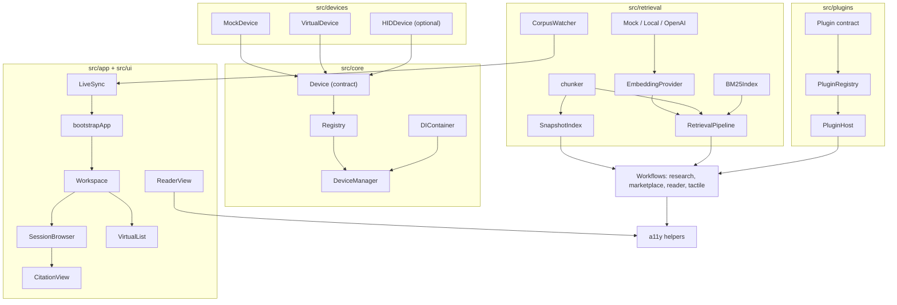
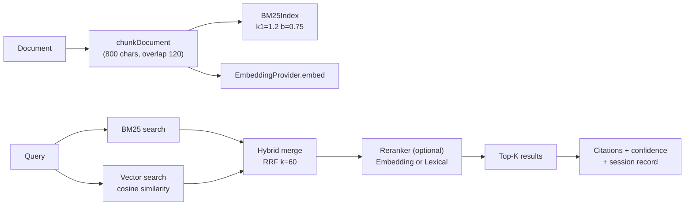
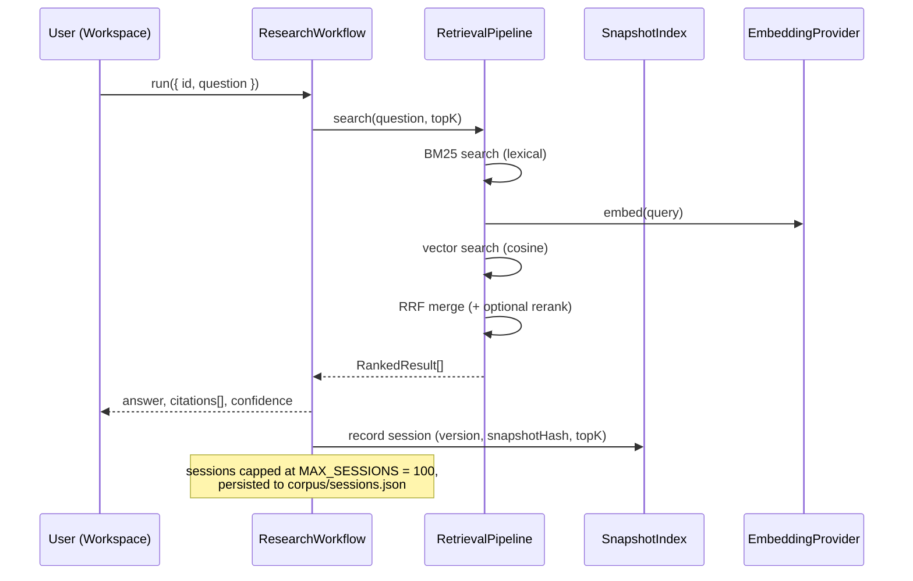

# Architecture

How AutoSD is put together, as built at v0.8.x. Everything here maps to shipped code. Pending work is called out explicitly at the end.

## Design principles

1. **Plugin-first.** Features register through seams (`PluginHost`, `DeviceManager`, DI tokens). Nothing hard-wires an implementation.
2. **Additive-only contracts.** `Device`, `Plugin`, `EmbeddingProvider`, and the exported types never lose fields or methods. New capability arrives as optional additions.
3. **Hot-swap everywhere.** Devices, plugins, and DI providers can be replaced at runtime without restart.
4. **Zero runtime dependencies.** Only devDependencies exist. Node built-ins are dynamically imported and aliased to empty stubs in the browser build.
5. **One accessibility gate.** WCAG 2.2 AA thresholds live in `src/accessibility/a11y.ts`. Feature code imports them; it never redefines them.
6. **Local-first persistence.** Plain JSON files under `corpus/`. No backend, no database.

## System overview



## Layers and dependencies

| Layer     | Files                                                                                 | Depends on                                                                                             |
| --------- | ------------------------------------------------------------------------------------- | ------------------------------------------------------------------------------------------------------ |
| Contracts | `core/Device.ts`, `plugins/types.ts`, `retrieval/types.ts`                            | nothing                                                                                                |
| Core      | `core/Registry.ts`, `core/DIContainer.ts`, `core/DeviceManager.ts`                    | contracts                                                                                              |
| Devices   | `devices/*.ts`                                                                        | `core/Device.ts`                                                                                       |
| Plugins   | `plugins/PluginRegistry.ts`, `plugins/PluginHost.ts`                                  | `plugins/types.ts`                                                                                     |
| Retrieval | `retrieval/*`                                                                         | retrieval types; `node:crypto`-free hashing in `chunker.ts`; dynamic `node:fs` for watcher/persistence |
| Workflows | `workflows/*.ts`                                                                      | core, retrieval, a11y                                                                                  |
| App       | `app/bootstrap.ts`, `app/LiveSync.ts`, `app/Workspace.ts`                             | workflows, ui, retrieval                                                                               |
| UI        | `ui/CitationView.ts`, `ui/SessionBrowser.ts`, `ui/ReaderView.ts`, `ui/VirtualList.ts` | workflows types, a11y                                                                                  |

No cycles. The public surface is the barrel in `src/index.ts`.

## Core seams

### Device and DeviceManager

`Device` (`src/core/Device.ts`) is the stable hardware seam: `connect`, `disconnect`, `write`, `read`, `render(pattern)`, plus typed events (`connected`, `disconnected`, `error`, `input`, `display`). Three implementations satisfy it:

- `MockDevice`: deterministic, in-memory, exposes the last rendered pattern for assertions.
- `VirtualDevice`: framebuffer simulation with configurable dot count, CI-safe.
- `HIDDevice`: WebHID / node-hid adapter behind a dynamic import. Degrades gracefully when neither exists.

`DeviceManager` owns a `Registry<Device>` and a `DIContainer`. It tracks one active device, fans out `broadcast(pattern)` to every registered device with per-device error isolation, and supports `hotSwap(id, nextDevice)` which preserves the id and emits `swapped` through the registry.

### Registry

Generic store with `register`, `unregister`, `swap`, `hotSwap`, and a `swapped` event. `DeviceManager` builds on it; the same pattern recurs in the plugin layer.

### DIContainer

String-token container with singleton and transient lifetimes, optional disposers, and `hotSwap(token, factory)` which disposes the previous singleton and clears its cache so the next `resolve` rebuilds. A global instance is exported as `container`. Well-known tokens:

| Token                | Registered value    | Consumer           |
| -------------------- | ------------------- | ------------------ |
| `embedding:provider` | `EmbeddingProvider` | `ResearchWorkflow` |
| `research:workflow`  | `ResearchWorkflow`  | `bootstrapApp`     |
| `liveSync`           | `LiveSync`          | `bootstrapApp`     |

## Plugin system

The contract (`src/plugins/types.ts`) is deliberately small:

```ts
interface Plugin {
  readonly id: string;
  readonly version: string;
  readonly description?: string;
  activate(ctx: PluginContext): Promise<void> | void;
  deactivate?(): Promise<void> | void;
}
```

`PluginContext` hands the plugin an `appVersion` and two API calls: `registerWorkflow(id, handler)` and `unregisterWorkflow(id)`. `PluginRegistry` tracks state per id (`registered`, `active`, `inactive`, `error`) and performs atomic `hotSwap`: deactivate old, replace, activate new. `PluginHost` is the single workflow dispatch point (`runWorkflow`, `hasWorkflow`, `listWorkflows`). Full walkthrough in `docs/PLUGIN_GUIDE.md`.

## Retrieval subsystem

Detailed tuning and provider notes live in `docs/RESEARCH_GUIDE.md`. The shape:



Components:

- `RetrievalPipeline` (`retrieval/pipeline.ts`): ingest, incremental add/remove, hybrid search. Reciprocal Rank Fusion combines BM25 and vector rankings with configurable weights and `rrfK = 60`.
- `SnapshotIndex` (`retrieval/snapshot.ts`): content-hash based incremental indexing. Unchanged documents are never re-chunked or re-embedded. Maintains versioned manifests and a reproducible snapshot hash.
- `CorpusWatcher` (`retrieval/CorpusWatcher.ts`): watches a directory, debounces 150 ms, reports `added` / `modified` / `deleted` documents.
- `LiveSync` (`app/LiveSync.ts`): wires the watcher to `ResearchWorkflow.ingest()` and disk persistence, exposing status (`Idle`, `Indexing`, `Updated`, `Error`).
- Providers (`retrieval/providers/`): `MockEmbeddingProvider` (deterministic hash vectors, default), `LocalEmbeddingProvider` (tries transformers.js, falls back to mock), `OpenAIEmbeddingProvider` (needs `OPENAI_API_KEY`).

## App and UI layer

`bootstrapApp()` (`src/app/bootstrap.ts`) is the composition root. It registers a default embedding provider if none exists, resolves or creates the `ResearchWorkflow` singleton, restores index and sessions from `corpus/`, starts `LiveSync` over `corpus/docs/`, and returns handles plus a `stop()` function.

`main.ts` mounts the browser app into `#app`: a sync status indicator, the `Workspace` (corpus manager, search panel, virtualized result list, citation inspector, session history), and a `ReaderView`. The mounted objects are exposed as `window.__AUTOSD__` for console experimentation.

UI components are framework-free DOM with accessibility built in:

- `VirtualList`: windowed rendering with keyboard navigation, focus restoration across scrolls, and full `aria-rowcount` / `aria-posinset` / `aria-setsize` semantics.
- `SessionBrowser`: lists retrieval sessions with confidence breakdowns, export and delete actions, arrow-key navigation.
- `CitationView`: renders grounded citations with labels announcing document, chunk, and confidence.
- `Workspace` announces every status change through polite live regions created by the shared a11y helpers.

## Data flow: one query end to end



With an empty corpus the workflow keeps its v0.3 backward-compatible stub behavior: a placeholder citation and low confidence rather than an error.

## Implemented vs pending

| Area                           | Status      | Notes                                                                           |
| ------------------------------ | ----------- | ------------------------------------------------------------------------------- |
| Device seam, Mock/Virtual/HID  | Implemented | Contract tests cover all three                                                  |
| Registry, DI, hot-swap         | Implemented | Covered by `tests/core/registry.test.ts`                                        |
| Plugin lifecycle + workflows   | Implemented | Atomic hot-swap tested                                                          |
| Hybrid retrieval (BM25 + RRF)  | Implemented | Tunables documented in `docs/RESEARCH_GUIDE.md`                                 |
| Incremental snapshot indexing  | Implemented | Hash-diffed, manifest versioned                                                 |
| Corpus watching + live sync    | Implemented | Top-level files, `.md` / `.txt` / `.json`                                       |
| Session persistence + export   | Implemented | `corpus/index.json`, `corpus/sessions.json`                                     |
| Local ONNX embeddings          | Partial     | `LocalEmbeddingProvider` falls back to mock when transformers.js is unavailable |
| Recall@k evaluation harness    | Pending     | Roadmap item; no published benchmarks yet                                       |
| Networked marketplace installs | Pending     | Catalog is an in-repo fixture today                                             |
| Plugin sandboxing              | Pending     | Roadmap item                                                                    |

Do not describe pending items as shipped in docs, changelogs, or PR descriptions.
