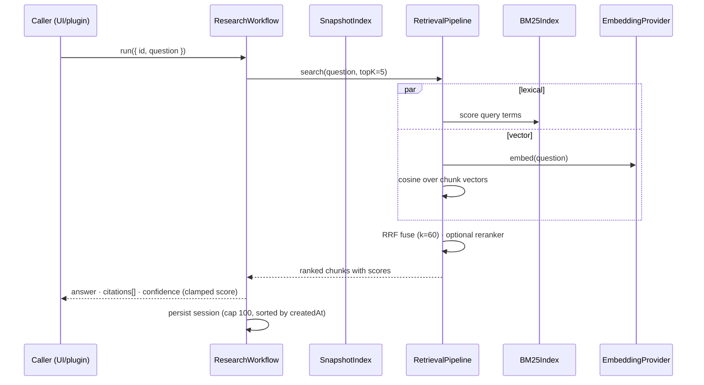
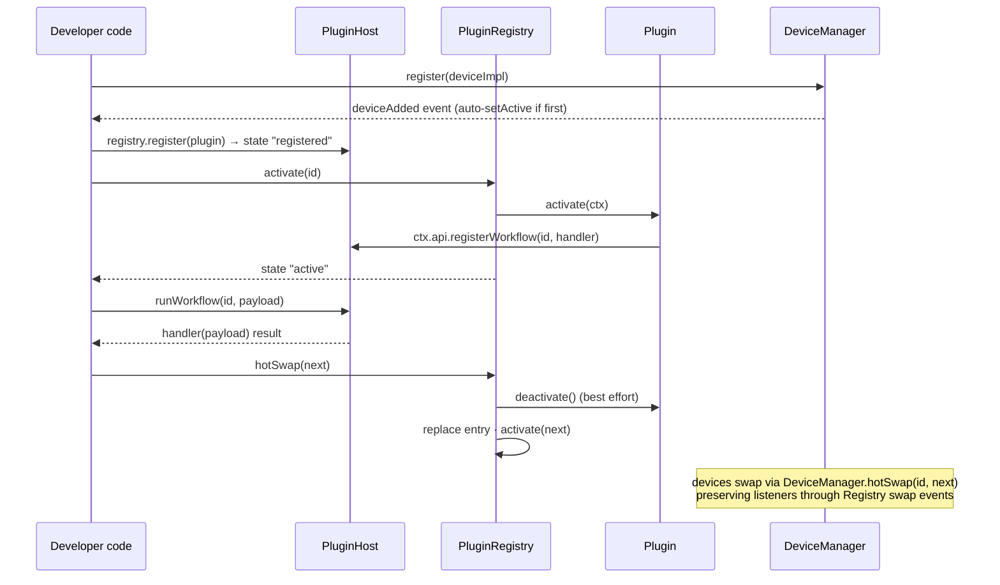
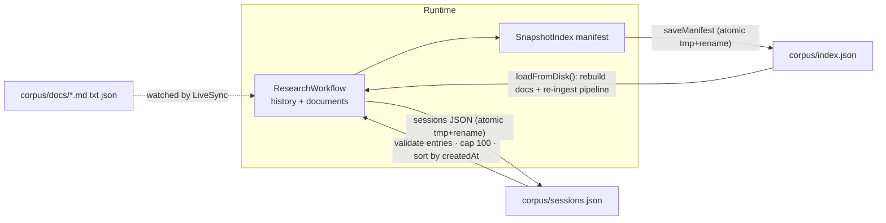
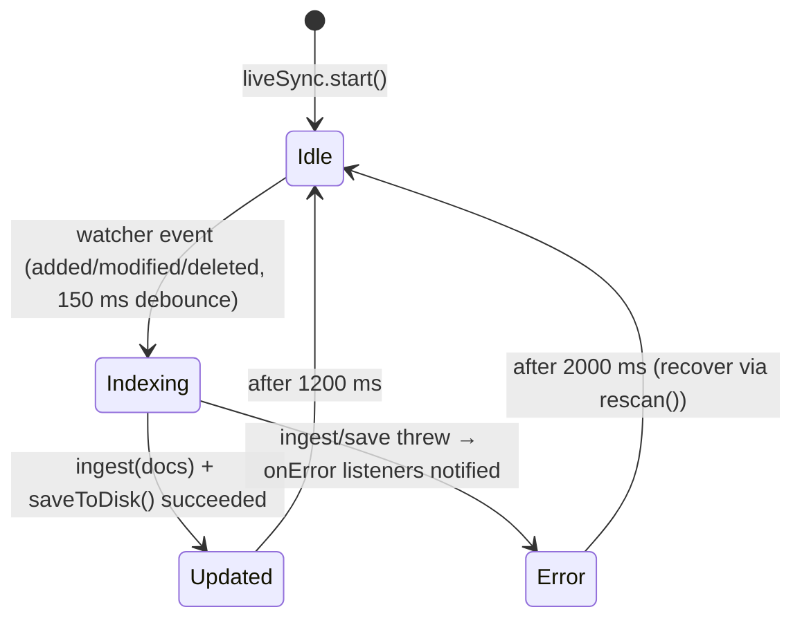

# Architecture Flows

Concise flow diagrams for the five paths contributors ask about most. Every diagram is traceable to the cited files at the v1.0.0 tree (plus the documented post-v1.0 additions). For layer overview see [ARCHITECTURE.md](ARCHITECTURE.md); for claim statuses see [CAPABILITY_MATRIX.md](CAPABILITY_MATRIX.md).

## 1. Application flow

Boot → config → workspace → router. Source: `src/main.ts`, `src/app/bootstrap.ts`, `src/app/router.ts`, `src/app/Workspace.ts`, `src/app/views/*`.

```mermaid
flowchart TD
  M["main.ts mounts #app"] --> B["bootstrapApp()"]
  B --> C["config.ts: read + validate VITE_ env<br/>(invalid values fall back, secrets warn)"]
  B --> W["ResearchWorkflow (DI provider or MockEmbeddingProvider)"]
  B --> DM["DeviceManager + default devices registered"]
  B --> R["AppRouter: nine hash routes, lazy views"]
  R -->|"#/home"| ONB["OnboardingStore flag → Onboarding or Home"]
  R -->|"#/workspace"| WV["WorkspaceView → Workspace facade"]
  R -->|"#/research" and "#/sessions" and "#/devices" and "#/demo"| LV["Lazy-loaded views"]
  W --> WV
  DM --> DV["DevicesView render controls"]
```

## 2. Research / retrieval flow

One query through the hybrid pipeline. Source: `src/workflows/research.ts` (`run()`), `src/retrieval/pipeline.ts`, `bm25.ts`, `embedder.ts`, `snapshot.ts`.



Ingestion side (`ingest()`): documents are hashed against the snapshot manifest — unchanged docs are never re-embedded; added/changed docs are chunked and embedded into the pipeline; removed docs are dropped from the pipeline.

## 3. Plugin / device flow

Registration, dispatch, and hot-swap across both seams. Source: `src/plugins/PluginHost.ts`, `PluginRegistry.ts`, `types.ts`; `src/core/DeviceManager.ts`, `Registry.ts`; walkthrough example `src/examples/MinimalTactilePlugin.ts`.



Device render isolation: `broadcast()` renders to every registered device; a per-device failure records a `DeviceErrorEvent` and never aborts the loop. `trySetActive()` is the non-throwing variant of `setActive()`.

## 4. Persistence flow

Plain JSON under `corpus/`; atomic writes everywhere. Source: `src/retrieval/persistence.ts`, `src/workflows/research.ts` (`saveToDisk`/`loadFromDisk`), `src/retrieval/snapshot.ts`.



Guarantees: every write goes through `atomicWrite` (temp file + rename); loads are defensive (`safeJsonParse`, shape guards); sessions never exceed `MAX_SESSIONS = 100`. There is no database and no backend — state is inspectable plain JSON.

## 5. Live synchronization flow

File watching → incremental ingest → persisted index → UI status. Source: `src/app/LiveSync.ts`, `src/retrieval/CorpusWatcher.ts`.



Details that matter:

- A cycle in flight sets `pending`; further events coalesce until it finishes.
- Deletions trigger a clear + re-ingest of remaining documents (simple and correct; not yet optimized).
- Status changes drive the accessible badge (`role="status"`) and a polite live-region announcement.
- Supported file types: `.md`, `.txt`, `.json`.
