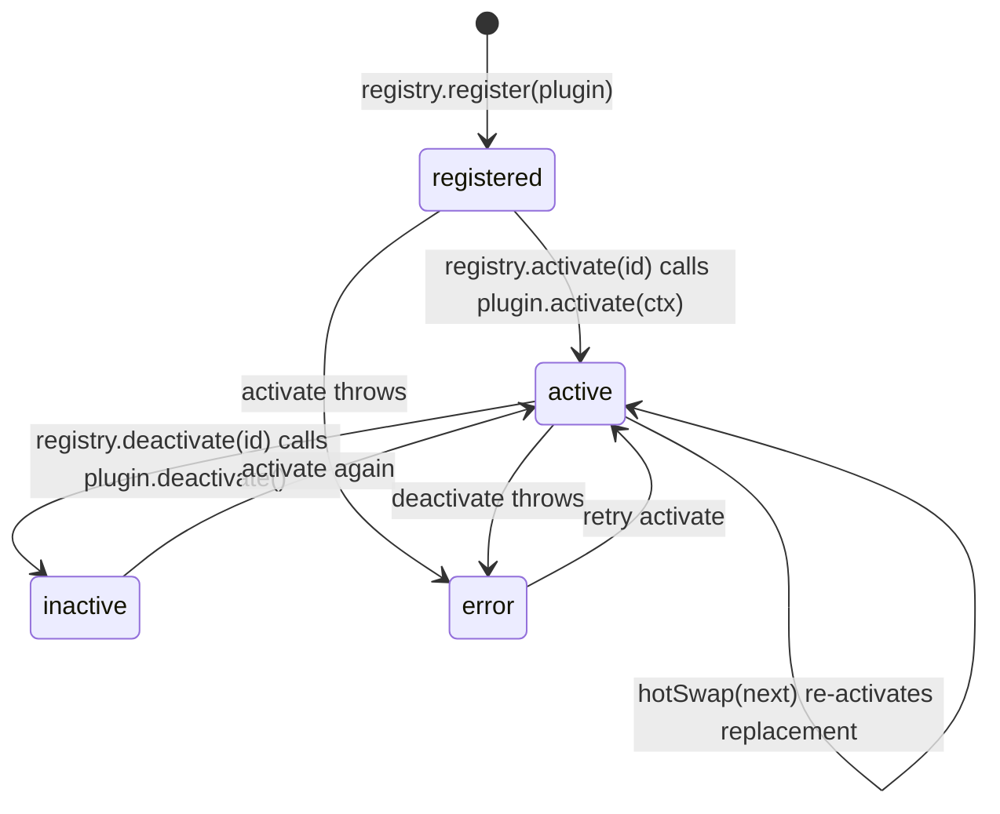

# Plugin Guide

How to write, register, and hot-swap an AutoSD plugin. Everything here reflects shipped code in `src/plugins/`. A complete working example lives at `src/examples/ExamplePlugin.ts`.

## The contract

From `src/plugins/types.ts`:

```ts
export type PluginContext = {
  readonly appVersion: string;
  readonly api: {
    registerWorkflow: (id: string, handler: WorkflowHandler) => void;
    unregisterWorkflow: (id: string) => void;
  };
};

export type WorkflowHandler = (payload: unknown) => Promise<unknown> | unknown;

export interface Plugin {
  readonly id: string;
  readonly version: string;
  readonly description?: string;
  activate(ctx: PluginContext): Promise<void> | void;
  deactivate?(): Promise<void> | void;
}
```

Only `id`, `version`, and `activate` are required. `deactivate` is optional but strongly recommended so hot-swaps can clean up.

## Lifecycle



Rules the registry enforces:

- Registering a duplicate id throws.
- `activate` failures set state to `error` and rethrow; the entry keeps the error for inspection via `registry.get(id)`.
- `hotSwap(next)` is atomic per id: it deactivates the current plugin (best effort), replaces the entry, and activates the replacement.

## Your first plugin

The smallest useful plugin registers one workflow during `activate`:

```ts
import type { Plugin, PluginContext } from "../plugins/types.js";

export class GreetPlugin implements Plugin {
  readonly id = "greet";
  readonly version = "1.0.0";
  readonly description = "Adds a greet workflow.";

  private ctx?: PluginContext;

  activate(ctx: PluginContext): void {
    this.ctx = ctx;
    ctx.api.registerWorkflow("greet:hello", (payload: unknown) => {
      const name = (payload as { name?: string } | undefined)?.name ?? "world";
      return `Hello, ${name}!`;
    });
  }

  deactivate(): void {
    this.ctx?.api.unregisterWorkflow("greet:hello");
    this.ctx = undefined;
  }
}
```

A fuller version with typed payloads and cleanup lives in `src/examples/ExamplePlugin.ts`. Copy it as a starting point.

## The complete walkthrough (devices + diagnostics)

`GreetPlugin` shows the lifecycle but never touches a device. For the full contributor arc — **interface → manifest fields → registration → VirtualDevice render → diagnostics-safe result → tests → removal** — read [`src/examples/MinimalTactilePlugin.ts`](../src/examples/MinimalTactilePlugin.ts). It registers one workflow (`minimal-tactile:render`) that renders text onto any `Device`, then returns metadata only: plugin id/version, device id/kind, dot count, active-dot count, the rendered pattern, and the framebuffer read-back.

What it teaches beyond `GreetPlugin`:

- **Devices are injected, not imported.** The constructor takes a `Device` (default: a fresh `VirtualDevice`); nothing in the plugin reaches for a global `DeviceManager`.
- **Read-back semantics differ by implementation.** `VirtualDevice.render()` writes its framebuffer, so render→read round-trips. `MockDevice.read()` only reflects `write()`, so post-render read-back is `null` there — the plugin reports this honestly instead of papering over it. Know which semantics your target device provides.
- **Results should be issue-safe.** The result contains no secrets, timestamps, or environment values; it passes through the diagnostics `sanitize()` helper unchanged (asserted in its test).
- **Removability.** Delete `src/examples/MinimalTactilePlugin.ts` plus `tests/examples/minimal-tactile-plugin.test.ts` and nothing else changes — no core edits, no barrel exports.

Its five-test suite lives at [`tests/examples/minimal-tactile-plugin.test.ts`](../tests/examples/minimal-tactile-plugin.test.ts) and doubles as executable documentation of the register → activate → run → deactivate → hot-swap path.

## Registering and running

Plugins are hosted by `PluginHost`, which owns a `PluginRegistry`:

```ts
import { PluginHost } from "./src/plugins/PluginHost.js";
import { ExamplePlugin } from "./src/examples/ExamplePlugin.js";

const host = new PluginHost(); // pass a version string if you want to override the default
host.registry.register(new ExamplePlugin());
await host.registry.activate("example-echo");

host.listWorkflows(); // ["example:echo"]
host.hasWorkflow("example:echo"); // true

const reply = await host.runWorkflow("example:echo", { message: "hi" });
await host.registry.hotSwap(new ExamplePlugin()); // replace without restart
```

Notes:

- `runWorkflow(id, payload)` is the only dispatch path. Workflows receive `unknown` payloads; validate inside your handler.
- Workflow ids are plain strings. Use a namespaced convention like `"yourplugin:action"` to avoid collisions.
- `deactivate` should undo what `activate` did: unregister workflows, close handles, clear timers.

## Hot-swap behavior

`PluginRegistry.hotSwap(next)` matches on `next.id`. If that id is currently active, the old instance's `deactivate()` runs first (errors swallowed), then the new instance is registered and activated. Tests in `tests/core/registry.test.ts` prove v1-to-v2 rebinding works atomically. This is how you iterate on a plugin inside a long-running process or swap implementations behind one id.

## Rules for plugin authors

1. **Do not reach into internals.** Work with what `PluginContext` gives you. Devices arrive through DI or workflow arguments, not by importing `DeviceManager` singletons.
2. **Additive only.** If you extend shared types, new fields must be optional. Never remove or rename existing ones.
3. **No side effects at import time.** Do work in `activate`, undo it in `deactivate`.
4. **Validate payloads.** Handlers receive `unknown`. Treat it as untrusted input.
5. **Keep activation fast and failure loud.** Throw in `activate` if you cannot start; the registry records the error state rather than leaving you half-active.
6. **Accessibility counts.** If your workflow produces UI, follow the WCAG 2.2 AA helpers in `src/accessibility/a11y.ts`.

## Testing your plugin

Follow the pattern in `tests/core/registry.test.ts`: construct a `PluginHost`, register, activate, run the workflow, assert results, then hot-swap and assert the new handler took over. Tests run under vitest in the node environment; add `/** @vitest-environment jsdom */` only if your plugin touches the DOM.

```bash
npx vitest run tests/examples   # runs the MinimalTactilePlugin walkthrough suite
npx vitest run tests/core       # registry/hot-swap lifecycle tests
npm run verify                  # full gate before opening a PR
```

## Distribution status

Today, distribution is the fixture catalog in `MarketplaceWorkflow` (`search`, `catalog`, `install` over an in-repo list). Install returns catalog entries; wiring a real plugin into a `PluginRegistry` is still manual. Networked discovery, signed installs, and sandboxing are roadmap items and do not exist yet. See `docs/ARCHITECTURE.md` ("Implemented vs pending") before promising any of this in docs or issues.
