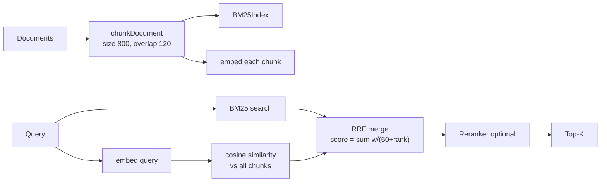

# Research Guide

Working with AutoSD's retrieval engine: ingesting corpora, adding embedding providers, and consuming citations. Everything here reflects shipped code in `src/retrieval/` and `src/workflows/research.ts`. A working provider example lives at `src/examples/ExampleRetrievalProvider.ts`.

## The pipeline in one page



Defaults (all tunable through `RetrievalPipeline` options):

| Knob           | Default | Meaning                                    |
| -------------- | ------- | ------------------------------------------ |
| `chunkSize`    | 800     | characters per chunk                       |
| `overlap`      | 120     | character overlap between chunks           |
| `topK`         | 5       | results returned by `search()`             |
| `bm25K1`       | 1.2     | BM25 term-frequency saturation             |
| `bm25B`        | 0.75    | BM25 length normalization                  |
| `rrfK`         | 60      | Reciprocal Rank Fusion constant            |
| `vectorWeight` | 1       | weight of the vector ranking in the fusion |
| `bm25Weight`   | 1       | weight of the BM25 ranking in the fusion   |

The chunker respects sentence and line boundaries when it can. Each chunk carries a content hash (`hashContent`, a 16-hex FNV-based digest). Empty documents produce zero chunks.

## Ingesting a corpus

### Manual ingest

```ts
import { ResearchWorkflow } from "./src/workflows/research.js";
import type { Document } from "./src/retrieval/types.js";

const wf = new ResearchWorkflow(); // resolves MockEmbeddingProvider by default

const docs: Document[] = [
  { id: "report-2026", content: "...long text...", path: "corpus/docs/report-2026.md" },
];

await wf.ingest(docs);
// returns { added, removed, chunkCount, manifestVersion }
```

Ingest is incremental. `SnapshotIndex` hashes every document; unchanged ids are skipped entirely (no re-chunk, no re-embed), changed ids replace their chunks, missing ids are removed. Each ingest bumps the manifest version and updates the snapshot hash you can read with `wf.getSnapshotHash()`.

### Live sync from disk

`bootstrapApp()` starts a `LiveSync` over `corpus/docs/`. Drop `.md`, `.txt`, or `.json` files there and the `CorpusWatcher` notices (150 ms debounce), triggers incremental ingest, and persists state to `corpus/index.json`. Deletions are handled too: remaining documents are re-ingested into a clean index.

```ts
import { bootstrapApp } from "./src/app/bootstrap.js";

const app = await bootstrapApp({ corpusDir: "corpus" });
app.liveSync.getStatus(); // "Idle" | "Indexing" | "Updated" | "Error"
app.stop(); // stop watching
```

Only top-level files of the watched directory are scanned. Dotfiles are ignored.

## Embedding providers

The interface (`src/retrieval/embedder.ts`):

```ts
export interface EmbeddingProvider {
  readonly id: string;
  readonly dimensions: number;
  readonly model: string;
  embed(text: string): Promise<number[]>;
  embedMany(texts: string[]): Promise<number[][]>;
}
```

Built-in providers:

| Provider                  | id       | Model label              | Dimensions | Behavior                                                                                                                                          |
| ------------------------- | -------- | ------------------------ | ---------- | ------------------------------------------------------------------------------------------------------------------------------------------------- |
| `MockEmbeddingProvider`   | `mock`   | `mock-384`               | 384        | Deterministic seeded hash vectors. Default everywhere. Required for CI.                                                                           |
| `LocalEmbeddingProvider`  | `local`  | `local-bge-small`        | 384        | Tries transformers.js (`Xenova/all-MiniLM-L6-v2`) via dynamic import. Falls back to prefixed mock vectors when unavailable; check `isFallback()`. |
| `OpenAIEmbeddingProvider` | `openai` | `text-embedding-3-small` | 1536       | Calls an OpenAI-compatible endpoint in one of three config modes (see below). Check `isConfigured()`.                                              |

### OpenAI configuration modes (v1.0)

`config.openaiMode` resolves to exactly one of:

1. **`none`** — no external AI: bootstrap registers the mock provider.
2. **`browser-endpoint`** — `VITE_OPENAI_BASE_URL` points at a validated public, pre-authorized gateway; the provider is constructed keyless and sends no `Authorization` header. Validation (https in production, no credential query params, no embedded `sk-` material, never `api.openai.com`) lives in `src/app/config.ts`; invalid values fall back to mode 1 with a name-only warning.
3. **`server-side`** — `OPENAI_API_KEY` exists in the process environment (Node/CLI/server only). The browser never holds a key; deploy a same-origin `/api/embeddings` passthrough that injects the key server-side and point mode 2 at it.

Precedence: `browser-endpoint` > `server-side` > `none`. Details and threat model: [SECURITY_ARCHITECTURE.md](SECURITY_ARCHITECTURE.md) §3.8.

Important honesty note: when `LocalEmbeddingProvider` falls back, its vectors come from the mock hash, not from MiniLM. Do not report local-model quality numbers unless `isFallback()` is false.

### Adding your own provider

Implement the interface and register it under the DI token `embedding:provider` (exported as `EMBEDDING_TOKEN`). A complete example lives at `src/examples/ExampleRetrievalProvider.ts`.

```ts
import { DIContainer } from "../core/DIContainer.js";
import { EMBEDDING_TOKEN } from "../workflows/research.js";
import { ExampleRetrievalProvider } from "../examples/ExampleRetrievalProvider.js";

const di = new DIContainer();
di.register(EMBEDDING_TOKEN, () => new ExampleRetrievalProvider());
const wf = new ResearchWorkflow({ di });
```

Swapping at runtime mirrors the device pattern:

```ts
di.hotSwap(EMBEDDING_TOKEN, () => new OpenAIEmbeddingProvider());
// Next ResearchWorkflow constructed with this di resolves the OpenAI provider.
```

Requirements for a good provider:

- Deterministic for the same input (tests depend on it).
- Normalized vectors if you want cosine scores to behave predictably.
- No network calls during tests. Keep network providers behind explicit configuration.
- Report real `dimensions` and `model`. Mixing providers with different dimensions invalidates existing embeddings; re-ingest after a swap.

## Querying and citations

```ts
const result = await wf.run({ id: "q-1", question: "what changed in v0.8?" });

result.answer; // string summary grounded in cited documents
result.confidence; // number between 0.15 and 0.95, derived from top score
result.citations; // ResearchCitation[]
```

Each citation carries:

| Field        | Meaning                                |
| ------------ | -------------------------------------- |
| `source`     | document id the chunk came from        |
| `documentId` | same as source, kept for explicitness  |
| `chunkId`    | stable chunk id like `"report-2026#2"` |
| `content`    | first 200 characters of the chunk      |
| `score`      | fused (or reranked) retrieval score    |

Confidence is computed from the best retrieved score and clamped to `[0.15, 0.95]`. It is a heuristic, not a calibrated probability. With an empty corpus the workflow returns its backward-compatible stub result (confidence 0.1) instead of failing.

## Sessions, reproducibility, export

Every `run()` records a `ResearchSession`: the query, the result, the manifest version, the snapshot hash, per-chunk top-K with their source (`bm25`, `vector`, `hybrid`, or `rerank`), and a timestamp. History is capped at 100 sessions (`MAX_SESSIONS`) and sorted by creation time.

- `wf.listSessions()`, `wf.getSession(id)`, `wf.deleteSession(id)`
- `wf.exportSession(id)` / `wf.exportLastSession()` return pretty-printed JSON
- `wf.saveToDisk(dir)` writes `index.json` and `sessions.json` atomically (temp file + rename)
- `wf.loadFromDisk(dir)` restores both; `bootstrapApp()` calls it on startup

Because sessions pin the snapshot hash, an exported session is reproducible evidence of exactly which index state produced the answer.

## What is not here yet

Be accurate when talking about evaluation:

- There is **no recall@k benchmark harness** yet. It is a roadmap item (PRD v0.4+ plan). Do not quote retrieval quality numbers.
- The answer text is assembled from retrieved chunks deterministically. There is no LLM generation step in the pipeline today.
- Per-chunk provenance beyond document id and chunk id (for example capture dates) is not modeled yet.

If you need any of these, open an RFC issue rather than bolting them on quietly.
