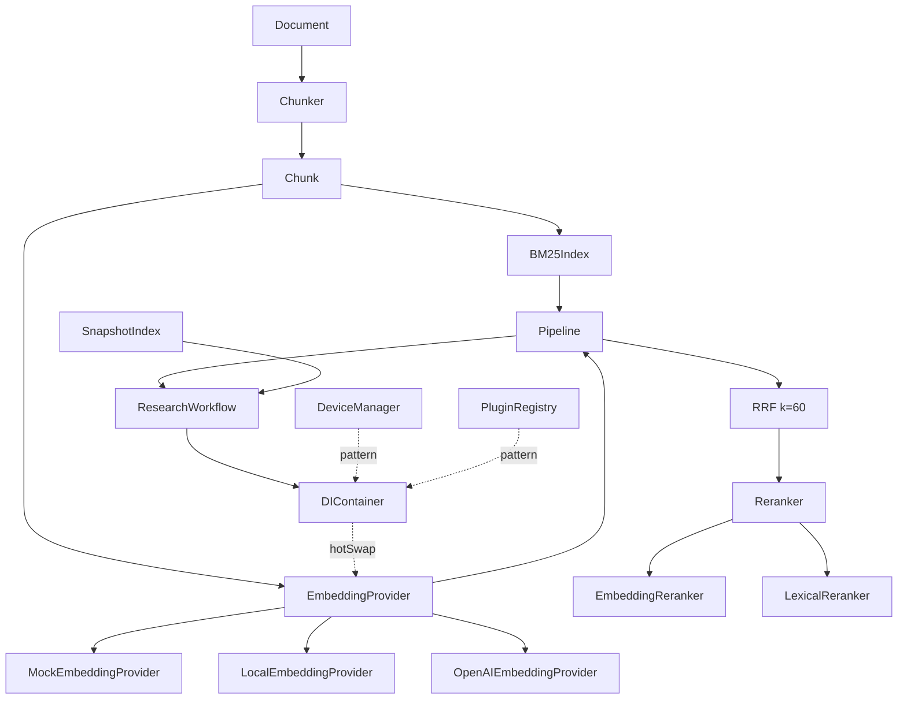

# Architecture — v0.4 Retrieval Engine

## Dependency Graph



## Layering

| Layer     | Files                        | Depends on                        |
| --------- | ---------------------------- | --------------------------------- |
| Types     | `retrieval/types.ts`         | —                                 |
| Chunking  | `chunker.ts`                 | types, node:crypto                |
| Embedding | `embedder.ts`, `providers/*` | types                             |
| BM25      | `bm25.ts`                    | types                             |
| Reranking | `reranker.ts`                | embedder                          |
| Pipeline  | `pipeline.ts`                | chunker, bm25, embedder, reranker |
| Snapshot  | `snapshot.ts`                | chunker, types                    |
| Workspace | `workflows/research.ts`      | pipeline, snapshot, DIContainer   |

No cycles. Retrieval has **zero runtime dependencies** (only `node:crypto`, `fetch` for OpenAI).

## DI Hot-Swap (mirrors DeviceManager)

```ts
const di = new DIContainer();
di.register(EMBEDDING_TOKEN, () => new MockEmbeddingProvider());
// later, without restart:
di.hotSwap(EMBEDDING_TOKEN, () => new OpenAIEmbeddingProvider());
const wf = new ResearchWorkflow({ di }); // resolves provider via DI
```

Same guarantees as `DeviceManager.hotSwap(id, nextDevice)` and `PluginRegistry.hotSwap(next)`.

## Test Coverage (v0.4)

- `src/retrieval` Stmts 96.71% / Lines 96.71% / Branch 92.94% / Funcs 92.85%
- `src/retrieval/providers` 93.97% (Mock 100%, Local 84%, OpenAI 100% with mocked fetch)
- Target >95% for retrieval module — **met** for core (96.71%).
